# rigidity

[](https://crates.io/crates/rigidity)
[](https://docs.rs/rigidity)
[](https://github.com/Dmitrii173173/rigidity/actions/workflows/ci.yml)
[](LICENSING.md)

**Point-cloud registration that tells you which degrees of freedom the geometry
actually determined — and which it did not.**

Classical ICP returns a pose and a residual. On a long corridor, a bare wall or
a weld seam it returns a *confident-looking* pose whose along-the-feature
component is essentially arbitrary. Nothing in the output says so.

```
$ rigidity register corridor_source.ply corridor_target.ply --noise 0.01 --tolerance 0.001

Translation:  x = -0.0300 m   y = -0.0190 m   z = -0.0100 m

RMSE: 0.00120 m   Correspondences: 34361   Iterations: 50

Condition number: 45.5

σ₁  spread   6.590e-5 m  HIGH    ρ=[+0.99 +0.00 +0.00] φ=[+0.00 +0.01 -0.01]

σ₂  spread   6.730e-5 m  HIGH    ρ=[+0.04 +0.00 +0.00] φ=[+0.00 +0.00 +0.17]

σ₃  spread   9.356e-5 m  HIGH    ρ=[+0.00 -0.01 +0.99] φ=[-0.02 +0.00 +0.00]

σ₄  spread   9.517e-5 m  HIGH    ρ=[+0.00 +0.11 +0.12] φ=[+0.17 +0.00 +0.00]

σ₅  spread   5.911e-4 m  HIGH    ρ=[-0.18 +0.00 +0.00] φ=[+0.00 +0.17 +0.00]

σ₆  spread   3.000e-3 m  MEDIUM  ρ=[+0.00 +1.00 +0.00] φ=[+0.00 +0.00 +0.00]

```

The true offset was `y = −0.0200`. It came back as `−0.0190` — a 1 mm error,
while every other axis is accurate to 0.01 mm. `σ₆` is exactly
`ρ = [0, 1, 0]`: translation along the corridor. The RMSE is *better* than on a
well-conditioned scene. Only the last line tells you not to trust that axis.

---

## Install

```
cargo install rigidity-cli
```

As a library:

```
cargo add rigidity
```

`rigidity` is a facade over the crates below; `default-features = false`
leaves the core alone, without the format parsers.

No system libraries. No Qt, no VTK, no Python. Builds from source on Linux,
macOS and Windows with nothing but a Rust toolchain — which is most of the
reason this exists in Rust rather than as another PCL module.

## Three commands

```bash
# Build a synthetic scene whose degenerate directions are known analytically
rigidity scene --kind corridor --points 20000 --out target.ply
rigidity scene --kind corridor --points 20000 --shift 0.03,0.02,0.01 --out source.ply

# What would this surface determine, before you even scan?
rigidity analyse target.ply --noise 0.01 --tolerance 0.001

# Register, and report what the answer is worth
rigidity register source.ply target.ply --noise 0.01 --tolerance 0.001
```

Two numbers give the report its meaning. `--noise` is your sensor's standard
deviation in metres. `--tolerance` is the accuracy your application needs.
A degeneracy threshold without a required accuracy is meaningless: 5 mm of
spread is excellent for a mobile robot and catastrophic for a welding cell.

## How it works

The point-to-plane Jacobian row is `[nᵀ | (p × n)ᵀ]`. Its singular spectrum
says how firmly the geometry pins each of the six rigid motions. Two details
make that spectrum trustworthy:

**The columns are made commensurate.** Translation columns are dimensionless,
rotation columns are metres, so the raw singular values cannot be compared and
the singular vectors depend on the choice of units — a verdict of "rotation
about Z is degenerate" can flip when you switch metres to millimetres. The
substitution `ξ' = [ρ; r_g·φ]`, with `r_g` the radius of gyration about the
centroid of the correspondences, puts all six coordinates in metres. There is
a test that fails if this invariance is lost.

**`JᵀJ` is never formed.** Squaring the matrix squares the condition number,
and the small singular values are the entire point of the exercise. `R` comes
from a tall-skinny QR built out of Givens rotations, and the spectrum from
one-sided Jacobi, which gives *relative* accuracy on the small values where the
QR algorithm gives only absolute accuracy.


Going through `J` costs `ε·κ`; going through `JᵀJ` costs `ε·κ²` — slope 1
against slope 2. At the project's operating point (κ ≈ 10⁷, set by storing
points as `f32`) the direct path errs by 3·10⁻¹¹ and the normal equations by
5 %, one order of magnitude away from losing the value entirely.

Every result is bit-for-bit reproducible regardless of thread count. The
reduction tree is fixed by construction, not by however `rayon` happened to
split the range — a floating `λ_min` would mean a floating detector.

## Is the prediction any good?

**On synthetic scenes, yes.** 1000 registrations per scene across seven scenes
with analytically known null spaces: the ratio of empirical spread to predicted
spread has median **0.993**, range 0.946–1.058.



**On real data, it is optimistic by a factor of about 17.** Measured on the ETH
ASL *Challenging Datasets* against millimetre-accurate theodolite ground truth:
19× on the mountain plain, 15× in the ETH Hauptgebäude corridor. The formula
assumes `N` *independent* measurements; real laser errors are correlated, and
the effective count is some 300× smaller than the nominal one — of 25 000
points, roughly seventy do the work.

The factor is stable across an open outdoor plain and an enclosed indoor
corridor, which matters more than its size: it is a systematic property of the
model rather than of the scene. Pass `--calibration 17` on real data.

## What this does not do

**Conditioning does not tell you whether you found the right minimum — but
something else does.** Conditioning describes the local shape of the cost
function. Inside a wrong local minimum the surfaces agree just as tightly and
the spectrum looks just as confident: on the plain, 11 of 30 scan pairs
converged to a wrong basin with condition numbers no worse than the successful
ones, every one of them reporting six directions of six determined.

The residuals do separate them, and `median_absolute_residual` is the test.
At the right minimum the residuals that remain are the sensor's own, so half
of them fall inside `σ`; at a wrong one they are the geometry's disagreement
and they do not. **Suspect the registration when the median absolute residual
exceeds the sensor noise** — no threshold to tune, and `rigidity register`
prints the warning itself.

Measured on four surveys of the ETH ASL data against theodolite truth — both
scenes, at 360° and cropped to ±40° and ±90°, taking "wrong basin" to mean
more than 0.10 m of translation error. It caught 62 of 64 wrong-basin edges,
let two through (out by 0.14 m and 2.15 m), and raised 6 false alarms in 164
sound edges — none at all on the two surveys where nothing had failed. The
threshold was fixed on one survey; the rest is out of sample. Use it together
with the conditioning report, not instead of it: one says whether this is the
right place, the other what the geometry there determines.

One qualification, measured afterwards and worth having: those counts come
from surveys registered the way a survey walks, each scan against the last.
Where overlap is deliberately reduced — the same scans cropped to a forward
sector, each pair started from the answer the uncropped scans gave — the
residuals grow for honest reasons and the test over-fires: on one such run it
flagged 24 registrations of which 9 were really in a wrong basin. It remains a
good warning and stops being a good filter when the view is narrow.

**It is not a calibrated uncertainty.** `σ_noise/σ'ᵢ` is a conditioning
diagnostic. The closed-form ICP covariance is known to understate real spread
by orders of magnitude (Landry, Pomerleau, Giguère, *CELLO-3D*, 2018), and the
measurement above reproduces exactly that. Treat the numbers as a *comparison*
between degrees of freedom — rank correlation with the truth is ≈ +0.33 on real
data — not as an absolute error bar.

**Rich geometry gains nothing.** In a furnished room or a forest, plain ICP
works and this only adds cost.

**It does not make a better pose-graph weight, and that was measured.** The
idea `rigidity-graph` was built for was to weight a survey's edges by what
each registration's geometry actually determined — dropping the directions
whose predicted spread exceeded the accuracy the survey asked for, rather
than trusting `JᵀWJ` along them. On scenes generated here it wins by 120×.
On real surveys it never wins at all: across the two ETH ASL scenes, five
fields of view from 360° down to ±30°, and six tolerances from 50 mm to
1 mm — sixty combinations — it either equals `JᵀWJ` or loses to it, by up
to 3.4×.

The reason is measurable and is the useful part. The threshold needs the
determined directions of an edge to be separated from the lost ones, and on
these scans there is no separation to find: `σ_min/σ_max` came out between
0.46 and 0.039 over every scene, field of view, voxel size and neighbourhood
tried, so all six spreads of an edge sit inside one order of magnitude. Any
threshold therefore keeps them all or drops them all. The four-order gap the
synthetic gates relied on is a property of geometry given exactly, not of
geometry that has been scanned — and it does not come back with better
normals. Growing the neighbourhood improves them a great deal: measured
against a plane fitted over half a metre, a normal's error falls from 12.5°
to 0.8° between the smallest neighbourhood tried and the largest. The
smallest singular value moves by a factor of two over that same range, and
between 1.2 and 2 depending on the scene. Four orders are what a threshold
would need.

**And the deeper reason, which took five failures to find: `JᵀWJ` is
already the right shape.** Registering the same pair two dozen times from
different starts shows where an edge's error actually comes from. The runs
land within half a millimetre of each other and seven millimetres from the
truth: the error is a *bias*, fourteen to thirty times larger than the
scatter around it. The closed form predicts that scatter correctly — 0.5 mm
predicted against 0.5 mm measured — and is simply blind to the bias. The
famous factor of seventeen is not an underestimated noise; it is the
bias counted as noise, and it comes out at 16.3, 16.5 and 16.6 across three
scenes.

The bias cannot be fixed by a weight, because a covariance describes
scatter and a bias is not scatter: inflating an edge only shifts trust to
other edges, which are biased too. But it can be located. Measured against
the geometry's own directions, the bias avoids the best-determined one on
every scene tried — |cos| of 0.175 to 0.195 where a random direction in six
dimensions gives 0.36. The error lives where the geometry is weak, which is
exactly what `JᵀWJ`'s anisotropy says.

So every attempt here to improve on `JᵀWJ` — a threshold, an additive
floor, a probabilistic attenuation, a floor tied to the measured bias, and
discarding the spectrum altogether — changed a shape that was already
right, and each won only where that shape did not matter. Improving on
`JᵀWJ` means subtracting the bias, not reweighting it, and that needs the
bias *direction*, which nothing measured here predicts.

`calibrated_information` accordingly no longer thresholds — and it is
called that because it no longer weights: through 0.1.1 the same function
was `weighted_information`, and 0.2.0 renames it rather than leave a name
promising something that was measured and withdrawn. It leaves out a
direction the geometry cannot see at all — an infinite spread contributes
nothing, which is not the same as contributing very little — and everywhere
else it is `JᵀWJ/σ²` restated in calibrated units. That restatement is worth
something on its own: with the ×17 in the sigma, a sixteen-station survey
admits 13.1 mm of spread where it is actually 16.0 mm out, and ±60° of view
admits 113.4 mm where it is 114.2 mm out. Without the calibration the same
survey claims 0.8 mm.

What survived is the diagnosis. Which directions are weak is still worth
reporting and still reported; turning that report into a binary weight is
the part that did not hold up.

## Prior art

Degeneracy-aware registration is not new. Thresholding the eigenvalues of the
point-to-plane Hessian and restricting the update to the well-conditioned
subspace is Zhang and Singh (2016); carrying that into a pose graph as a factor
constraining only the non-degenerate directions is Hinduja, Bartlett and Kaess
(IROS 2019). Replacing the threshold with a probability derived from a noise
model is Hatleskog and Alexis (RA-L 2024), whose code is public. Learning the
covariance from data instead of deriving it is CELLO-3D (Landry, Pomerleau and
Giguère, 2019), and propagating the initialisation's uncertainty while
accounting for ICP's bias is Brossard, Bonnabel and Barrau (2020).

The contribution here is not the idea but the measurement: this repository
runs those weightings against millimetre theodolite ground truth on whole
surveys, which is a thing several of those papers could not do — the
probabilistic method's own evaluation has ground truth in one of its four
experiments. What that measurement says is above, and it is mostly negative.

- Zhang, Kaess, Singh. *On Degeneracy of Optimization-based State Estimation
  Problems.* ICRA 2016.
- Gelfand, Ikemoto, Rusinkiewicz, Levoy. *Geometrically Stable Sampling for the
  ICP Algorithm.* 3DIM 2003.
- Censi. *An Accurate Closed-Form Estimate of ICP's Covariance.* ICRA 2007.
- Landry, Pomerleau, Giguère. *CELLO-3D: Estimating the Covariance of ICP in
  the Real World.* 2018.
- Tuna, Nubert, Nava, Khattak, Hutter. *X-ICP: Localizability-Aware LiDAR
  Registration.* T-RO 2023.

## Performance

Against the same input and the same accuracy target — the full pipeline, from
reading the files to reaching 0.1 mm, on a million points:

| | iterations | median | error |
|---|---|---|---|
| **rigidity** | 2 | **0.070 s** | 4.74·10⁻⁵ m |
| Open3D 0.19.0 | 2 | 0.108 s | 9.54·10⁻⁵ m |
| PCL 1.15.1 | 2 | 0.239 s | 4.58·10⁻⁵ m |

Read this as a comparison of *pipelines*, not solvers: ICP itself is 12 % of
that time, and voxel downsampling is half. Our downsampling is the single most
expensive stage precisely because it is sort-based and therefore deterministic,
where a hash grid would be `O(n)` — and the total is still the fastest of the
three. Protocol and caveats: [`bench-external/`](bench-external/).

## Crates

| crate | what |
|---|---|
| [`rigidity`](https://docs.rs/rigidity) | the facade: one dependency that re-exports the rest, feature-gated |
| [`rigidity-core`](https://docs.rs/rigidity-core) | Lie groups, ICP, TSQR, conditioning. Depends on `nalgebra`, `rayon`, `thiserror` — and nothing else, enforced in CI |
| [`rigidity-spatial`](https://docs.rs/rigidity-spatial) | kd-tree over `kiddo` |
| [`rigidity-scenes`](https://docs.rs/rigidity-scenes) | synthetic scenes with analytically known null spaces |
| [`rigidity-io`](https://docs.rs/rigidity-io) | PLY and PCD (own parsers), LAS/LAZ, E57, delimited text (`.txt`, `.csv`) — read and write |
| [`rigidity-pipeline`](https://docs.rs/rigidity-pipeline) | file → surface → registration → report; the sequence every front end must run in the same order |
| [`rigidity-graph`](https://docs.rs/rigidity-graph) | pose graphs, with the calibration in each edge's information and a direction the geometry cannot see left out of it |
| [`rigidity-viz`](https://docs.rs/rigidity-viz) | Rerun logging, behind the `rerun` feature |
| [`rigidity-cli`](https://crates.io/crates/rigidity-cli) | the binary |

## Building

```bash
cargo test --workspace
cargo clippy --workspace --all-targets -- -D warnings
```

Recording a registration for the [Rerun](https://rerun.io) viewer:

```bash
cargo run -p rigidity-cli --features viz --release \
    --example record_registration -- corridor.rrd
rerun corridor.rrd
```

## License

Licensed under **AGPL-3.0-only**, and under nothing else.

Free under the [AGPL](LICENSE) for everyone. Note that in Rust a crate that
depends on `rigidity-core` is a derivative work, so the AGPL reaches the
whole binary; running it internally without distributing the result asks
nothing of you, and anything you distribute or host as a service has to be
released under the AGPL with its source. [`LICENSING.md`](LICENSING.md) has
the boundary in a table.
